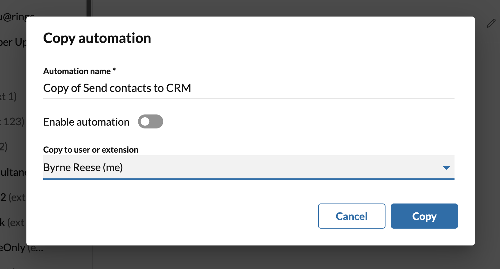

# Copying workflows 

Any user can make a copy of a workflow that they own/created. Admins have the exclusive ability to copy workflows to another user's account. This ability is useful when needing to deploy the same workflow in a standardized way to a relatively large number of accounts or extensions. 

<figure markdown>
  
  <figcaption>Replicate workflows across your account</figcaption>
</figure>

