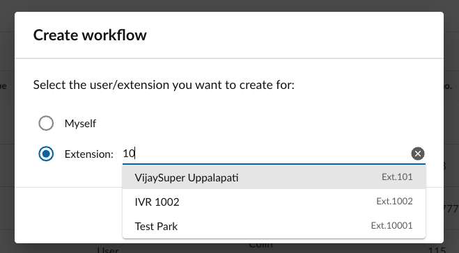

# Managing workflows across your company

The most used administrative feature is the ability for account Super Admins to create, edit and manage automations for other users. The empowers IT administrators, executive assistants and others to help a coworker, or step in as needed to make necessary edits or changes to the workflows that power a company. 

You will know if you are an administrator if you see the "Company workflows" tab on the Workflow Builder home screen.

{ style="max-width: 450px" }

## Editing an existing workflow

To edit another user's workflow, browse the list of workflows under the Company workkflows tab. 

### Grouping workflows to assist in navigation

It may be helpful to use the grouping mechanism on the table listing to more quickly find the workflow in question. Admins can group workflows by:

* Extension
* Extension type
* Trigger type

## Adding a workflow

To create a workflow for another user or extension, start from the "Company workflows" tab, and click "Create workflow." Then choose to create the extension not for yourself, but for an extension. Search for the extenion or person's name. Then click "Next."

