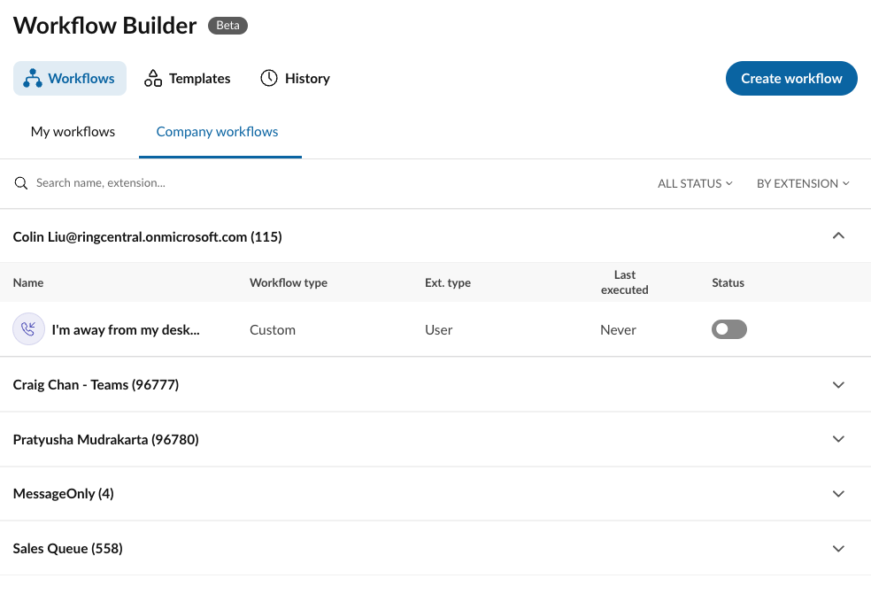

# Managing workflows for call queues and other extension types

Workflow Builder can create workflows for [users](manage.md) and non-user-based extensions such as:

* IVR menus
* Call queues
* Message-only

This allows Workflow Builder to address common use cases such as the following:

* Sending an SMS when a call is not picked up from a call queue
* [Sending an SMS when someone navigates an IVR menu](https://community.ringcentral.com/workflow-builder-23/how-can-i-set-up-an-automatic-sms-reply-when-a-user-presses-a-key-on-the-ivr-menu-9855)

Creating and editing workflows for non-user-based extensions is the same as [managing workflows for normal users](manage.md). We suggest the following to help make this process easier:

* Group workflows by extension or extension type
* Use descriptive names for your call queues and other extensions

!!! info "Only most recent ten users will be displayed"
    During the beta, only the most recently added ten users will be listed in your list of users/extensions. If you have more than ten active users, they are still in the system, and their workflows will continue to run even if they are not in your list of users. You may always add them back to your list of users if you need to view or manage their workflows on their behalf.

## Tips for managing non-user-based workflows

Creating workflows for other users is very intuitive as they tend to behave as we expect, as phone systems are by-default somewhat human-centric. Non-user workflows on the other hand require some finesse as there exist call routing nuances unique to these types of extensions. 

### Runners, and overriding what phone numbers and resources are available

For Call Queue, Voicemail, IvrMenu and Park Location extension types, workflows are run on behalf of the person who created the workflow by default. In other words, if you were to inspect your company’s audit trail, the creator of the workflow would be seen as the user who performed the actions within the workflow.

Administrators have the ability to specify another user to run a workflow on behalf of. This may give one workflow access to features and phone numbers they might otherwise not have access to. This is especially helpful you want to receive an SMS from one phone number, and respond to the SMS from another phone number, or sending SMS from the main company number. 

* Learn more about modifying the [runner of a workflow](runner.md)

## Not all events fire for all extension types

There is some nuance in understanding what events are fired for what extension types, as how we often think about these things differs from what happens from a networking perspective. For example:

* IVR menus: only the [call received](../workflows/custom/triggers/call-received.md) and [call ended](../workflows/custom/triggers/call-ended.md) triggers are supported. The [missed call event](../workflows/custom/triggers/call-missed.md) is not supported for IvrMenu. 

* Call queues: call queues only "miss" a call if the person hangs up while on the call queue. If no one picks up a call on a call queue and the call is routed else where, the call is technically not "missed" - it is in fact connected successfully somewhere else.

