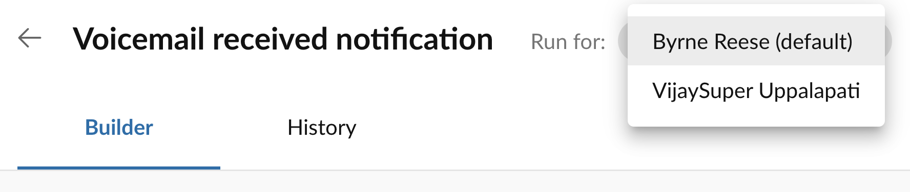

# Modifying the runner of a workflow

Workflow Builder allows for admins to create workflows on behalf of others. These workflows, or any workflow for that matter, distinguishes between two key roles related to each workflow. They are:

* **Owner**. The owner of the workflow determines under which user or extension the workflow is listed. This helps primarily with the organization and categorization of workflows. 

* **Runner**. The runner of the workflow is the identity through which the workflow is executed. This primariy affects the audit trail within RingCentral. For example, let's say there is a workflow that sends an SMS. If that workflow is executed using Jane's identity, then the audit trail will show that Jane sent the SMS messages triggered by that workflow. 

Workflow Builder allows only Super Admins to modify the runner of a workflow associated with a user in their account. This is done either by editing the workflow template, or by editing the trigger associated with an advanced workflow. 

Admins can set the runner of a workflow according to the following constraints:

* Extensions of type User can be run on behalf of any Super Admin or the workflow's owner. 
* Extensions of type Call Queue, Voicemail and Park Location can be run on behalf of any Super Admin or the Operator extension. 

The runner of a workflow can only be assigned to accounts that have been activated by someone logging into that account. 

