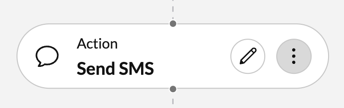

# Action: send SMS

{ style="max-width: 50%; margin: 0 auto; text-align:center" }

Sends text via SMS from one phone number, to another phone number. When using the "Send SMS" action, please bear in mind the following:

* sending SMS via the RingCentral platform may incur additional costs depending upon your license
* sending an SMS does not guarantee that an SMS message will be delivered, especially if the receiving phone number is incapable of receiving an SMS, e.g. a fax machine
* one's ability to send an SMS depends upon the automator's owner being assigned a phone number from which SMS are allowed to be sent
* one's ability to send an SMS depends upon an administrator setting up their account properly to send SMS after having gone through the TCR process of registering campaigns and so forth

!!! info "Enabling SMS for your account"
    If you are having difficulty sending SMS from your account, or if you see the following message when editing a "Send SMS" action node, then please consult our [troubleshooting guide](../../support.md) to help diagnose the root cause.
	
    > You are not permitted to send SMS messages because your phone number is not yet setup for SMS. To resolve this problem please consult our help documentation.

## Input

| Variable            | Type   | Description                                     |
|---------------------|--------|-------------------------------------------------|
| **Sender's phone number** | Phone number| This refers to the phone number the recipient of the SMS will see as the sender of the message they receive. A user can only send SMS messages from phone numbers they are authorized to send SMS messages from, and from phone numbers that for which SMS has been enabled. |
| **Recipient's phone number** | Phone number | This refers to the phone number the SMS message will be sent to. While there are no restrictions placed on the recipient's phone number, users should be aware that not all phone number are necessarily capable of receiving an SMS, and that Automator is not able to distinguish between those than can and those that can't receive SMS. |
| **Message text** | String | The message you wish to send to the recipient. Users can insert variables into a message that can will be substituted for the corresponding value prior to the message being sent. For example, you wish to address the receipient by name, you can insert the following variable into your SMS text message: `{trigger.sender.name}`. To see a complete list of variables you can insert into a message, type the "#" (hash sign) into the text input. |

## Output

None. 

