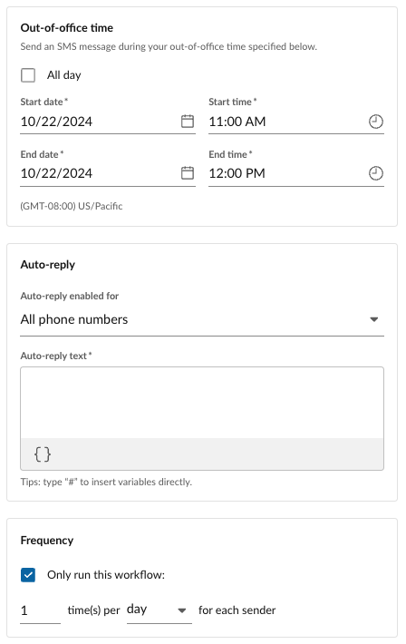

# RingCentral Automator

!!! warning "RingCentral Automator is becoming Workflow Builder"
    Since January 9, 2023 Automator has executed over three million workflows, and has reached tens of thousands of RingCentral customers, helping them to automate common tasks, and even help [grow their businesses](https://www.ringcentral.com/whyringcentral/casestudies/saving-lives-society.html). The incubation period for this product is coming to an end, and soon, Automator will get a major upgrade and become the [RingCentral Workflow Builder](https://community.ringcentral.com/workflow-builder-23/automator-is-becoming-workflow-builder-9861). [Join the beta](https://docs.google.com/forms/d/e/1FAIpQLScH3nJMIW9DcaCk012Ba9VrzPk_zmSzuQTJgUML3L4tsBycng/viewform) today and get ready for the next major phase of phase of workflow automation at RingCentral.

## What is RingCentral Automator?

!!! tip inline end "Share your workflow"
    Have a workflow you love? Export and share it with the community as a [recipe](recipes/index.md).
	
	[Share your recipe via Github &raquo;](https://github.com/ringcentral/ringcentral-automator-docs/issues/new)

Welcome to RingCentral Automator, a no-code workflow design tool created to help RingCentral customers automate common tasks and workflows, as well as design their own custom workflows to address use cases not solved by one of our pre-existing [workflow templates](./workflow-templates/index.md). 

## Getting started using RingCentral Automator

The fastest way to get started using RingCentral Automator is to select an automation from a list of pre-packaged, pre-designed automation templates. Automation templates make implementing an automation as simple as filling out a simple form. 

To create an automation, click the "New automation" button found in the upper-right corner of the automation listing screen. A dialog will appear allowing you to select from a number of templates, our most popular being:

* [**Out-of-office auto-reply**](./workflow-templates/ooo-autoreplies.md). Reply to an SMS when you are out of the office, on vacation or away. 
* [**Missed call auto-reply**](./workflow-templates/missed-call.md). Let people know you are on the phone and will call them back.
* [**After-hours auto-reply**](./workflow-templates/after-hours.md). Let people know that you missed their call because they called during non-business hours. 

If your needs are not addressed by an existing template, then it is entirely possible the problem you are trying to solve can be addressed by creating a [custom workflow](./custom-workflows/index.md). A custom workflow allows users to design their own solutions using a drag-and-drop user interface. 

## Automator: a NO-code automation tool

The greatest advantage of Automator is that it is generally accessible and usable to everyone. Automator helps to democratize the RingCentral Platform by allowing developers and NON-developers alike to build and deploy simple applications to perform repeatable tasks. 

Even if you don't know how to code, or even if the thought of "code" gives you hives, anyone can create an automation using a ready-made automation template. 

<figure markdown>
  
  <figcaption>Automation templates are as easy to use as filling out a form</figcaption>
</figure>

## Automator: a LOW-code developer tool

For those more comfortable with basic technical concepts, like if-statements, variables and actions, Automator provides users with a simple drag-and-drop workflow design tool to make building apps quick and easy. You do not need to know a programming language, and with a little time, literally anyone can learn how to create an automation. 

<figure markdown>
  
  <figcaption>Automator's workflow designer makes building simple apps as easy as drag-and-drop</figcaption>
</figure>

## Built by RingCentral Labs

RingCentral Labs solutions are a set of free, customizable, curated solutions built by RingCentral developers. They are designed to provide finished end-user solutions that solve common problems. RingCentral Labs apps are free to use, but are not official products, and should be considered community projects - these apps are not officially tested or documented.
