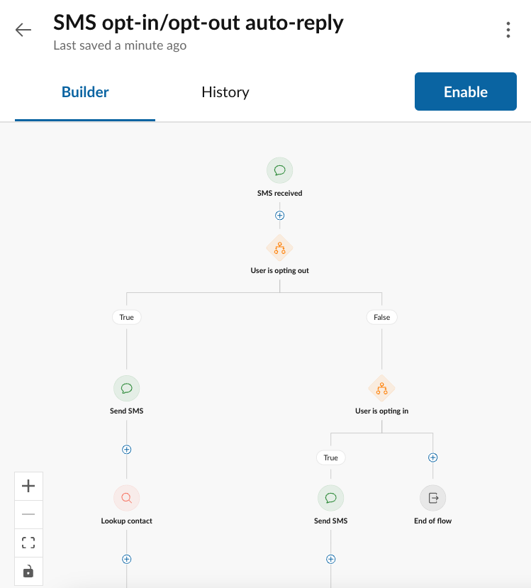

---
hide:
  - navigation
---
# RingCentral's Workflow Builder

!!! warning "RingCentral Automator is becoming Workflow Builder"
    Since January 9, 2023 Automator has executed over three million workflows, and has reached tens of thousands of RingCentral customers, helping them to automate common tasks, and even help [grow their businesses](https://www.ringcentral.com/whyringcentral/casestudies/saving-lives-society.html). The incubation period for this product is coming to an end, and soon, Automator will get a major upgrade and become the [RingCentral Workflow Builder](https://community.ringcentral.com/workflow-builder-23/automator-is-becoming-workflow-builder-9861). [Join the beta](https://docs.google.com/forms/d/e/1FAIpQLScH3nJMIW9DcaCk012Ba9VrzPk_zmSzuQTJgUML3L4tsBycng/viewform) today and get ready for the next major phase of phase of workflow automation at RingCentral.

## What is RingCentral's Workflow Builder?

Welcome to RingCentral's Workflow Builder, a no-code workflow design tool created to help RingCentral customers automate common tasks and workflows, as well as design their own custom workflows to address use cases not solved by one of our pre-existing [workflow templates](./workflows/index.md). 

## Getting started using Workflow Builder

The fastest way to get started using RingCentral's Workflow Builder is to select a workflow from a list of pre-packaged, pre-designed workflow templates. Workflow templates make implementing a workflow as simple as filling out a simple form. 

To create a workflow, click the "New workflow" button found in the upper-right corner of the workflow listing screen. You will then be presented with a number of templates to choose from, the most popular being:

* [**Out-of-office auto-reply**](./workflows/templates/ooo-autoreplies.md). Reply to an SMS when you are out of the office, on vacation or away. 
* [**After-hours auto-reply**](./workflows/templates/after-hours.md). Let people know that you missed their call because they called during non-business hours. 

[:fontawesome-solid-rocket: Get started](users/index.md){ .md-button .md-button--primary }

## Workflow Builder: a NO-code automation tool

The greatest advantage of Workflow Builder is that it is generally accessible and usable to everyone. Workflow Builder helps to democratize the RingCentral Developer Platform by allowing NON-developers and developers alike to build and deploy simple applications to perform repeatable tasks. 

Even if you don't know how to code, or even if the thought of "code" gives you hives, anyone can create a workflow using a ready-made template. 

<figure markdown>
  
  <figcaption>Workflow templates are as easy to use as filling out a form</figcaption>
</figure>

## Workflow Builder: a LOW-code developer tool

For those more comfortable with basic technical concepts, like if-statements, variables and actions, Workflow Builder provides users with a simple drag-and-drop workflow design tool to make building apps quick and easy. You do not need to know a programming language, and with a little time, literally anyone can learn how to create a workflow. 

<figure markdown>
  
  <figcaption>Workflow Builder's workflow designer makes building simple apps as easy as drag-and-drop</figcaption>
</figure>

