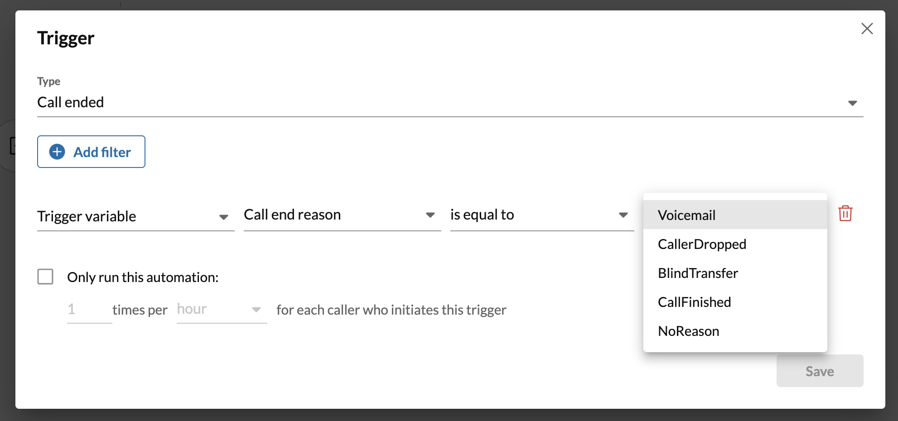
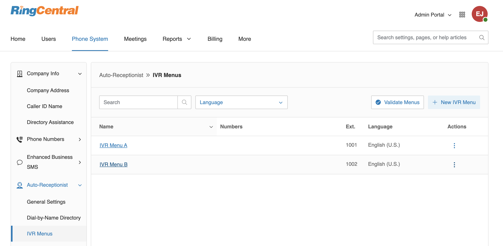
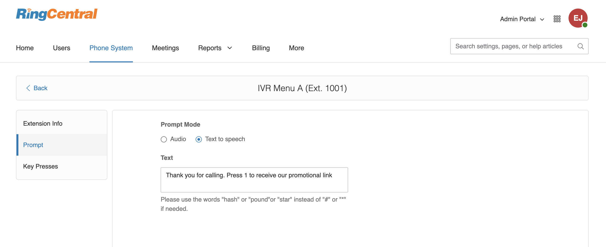
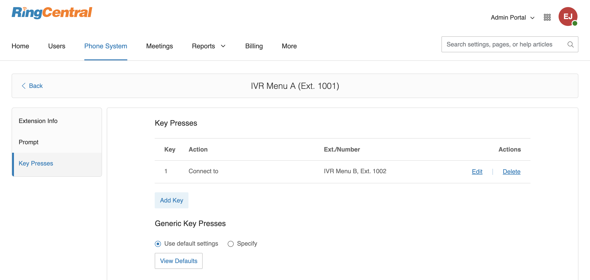
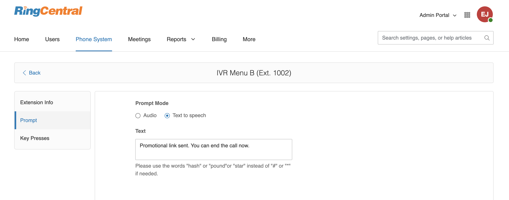
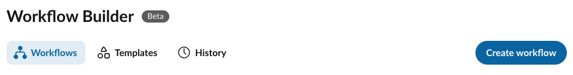
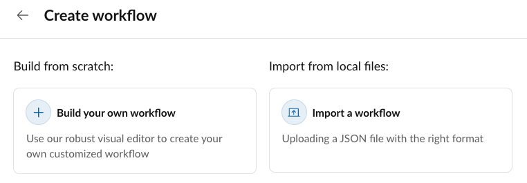

# Triggering automations within an IVR menu

For extensions of type `IvrMenu`, only "Call Received" and "Call Ended" triggers are currently supported. IVR menus cannot technically miss a call in our system today. 

For the "Call ended" trigger, there is a variable "Call end reason" that holds one of the following values:

* Voicemail
* CallerDropped
* BlindTransfer
* CallFinished
* NoReason

## Properly detecting if an IVR menu "missed" a call

One can use the "Call end reason" variable to determine if a caller ended the call before pressing a key. For example, let's say you have an IVR menu that prompts people with, "Press 1 to speak to Sales, press 2 to leave a voicemail." When user end the call without pressing any key, "Call end reason" will be "CallerDropped". But when user is redirected by pressing 1, "Call end reason" will be "NoReason". 

## Detecting what key a user pressed in an IVR menu

For now, there is no way to detect specific key a user pressed in an IVR menu, but we can make some reasonable inferrences depending upon what extensions an IVR menu might direct a user to. For example, if an IVR menu directs someone to a extension 203, and if the IVR menu is the only way a user could navigate to that extension, then one could place a "Call received" trigger on extension 203 - thereby detecting that someone previously selected it via an IVR menu. 

### Step 1: Setup IVR menus in RingCentral admin portal

We will have two IVR menus. 

First menu is the IVR menu that you want caller to press keys to trigger automation. Let's call the first extension "IVR Menu 1".

Let's set prompt to say "Press 1 get to a link by SMS":

In Key presses, let's make Key 1 connect to IVR Menu B.

In IVR Menu B, let's set prompt to say "A SMS is sent to you with link":

### Step 2: Setup automation in Automator

Login into RingCentral Automator with admin account. Then **go to IVR Menu B's page**:

Import following automation template file n for IVR Menu B:

[:fontawesome-solid-download: Download automation](ivr-menu-key-press.json){: download .md-button }

After imported, You can also update the automation to setup other actions and logics for call received trigger.

**Enable** the automation, then all DONE. When call to IVR Menu A, then caller press 1. Caller will be redirect to IVR Menu B. Then a SMS will be sent.

### Step 3: Other key presses

To setup other key press, you need to create a new IVR Menu C. Then setup key 2 connect to IVR Menu C in IVR Menu A. Then import other automation for IVR Menu C in Automator.
