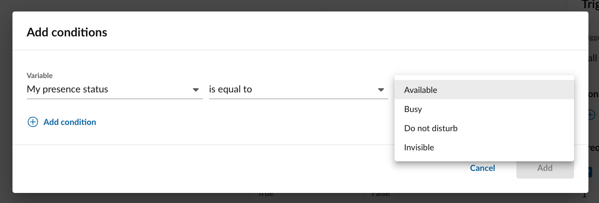

---
tags:
  - recipe
  - SMS
  - presence
  - unavailable
---

# Send an SMS when your presence is "unavailable"

This automation will help you if you need to respond to people sending you an SMS while you are otherwise occupied. Perhaps you are on the phone with another customer, or your status has been set to "do not disturb" -- regardless, if your presence status is anything except the value of "Available," the person messaging you will get an SMS letting them know. 

Feel free to customize the automation by editing the filters associated with the trigger. You can select different statuses, or you could apply the same basic logic to another trigger so that you can auto-reply people sending you a DM, or someone who is calling you. 

!!! hint "Delivery of SMS is not guaranteed"
    Please bear in mind that only phone numbers capable of receiving SMS will receive a response. If you miss a call from someone who called from a non-SMS-enabled phone, then they are unlikely to get your auto-reply. 

[:fontawesome-solid-download: Download automation](unavailable.json){ .md-button }

Learn how to [import it into your account](../user-guide.md#importing-automations). 

