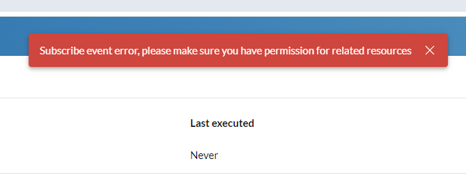

# Troubleshooting

## Why isn't my automation getting triggered?

One of the most common questions from users of Automator happens when they setup an automation for the first time, and then try to trigger the automation by placing a phone call. They observe that their automation is not getting triggered, and they want to understand why. This is especially true for automations that are triggered in some way by a phone call. 

In most cases, the trick to solving this problem rests in understanding how phone calls are routed through an account based on the account's call handling rules. That is because automations must be associated with where a call ultimately terminates in order for those automations to be triggered. Let's look at a common example in which one wants to send an SMS when a call is missed from a call queue. 

First, let's look at what the customer experiences and how this is typically configured in RingCentral. 

1. A customer calls your main company number, typically extension 101. 
2. The customer hears an IVR prompt, "press one if you are an existing client, or press two for sales."
3. The customer presses "2" and the call is transfered to a new extension of type "Call Queue," say extension 105.
4. The customer waits at extension 105 for someone to become available.
5. The customer waits a while, grows impatient, and hangs up. The call has now been missed.

When looking at this flow, many will create an automation associated with the main company number, because that is what the customer dialed to contact them. This is a very logical conclusion to make. However, if you want to send an SMS when a call is missed while waiting for a member of the sales team to answer the phone, then in actuality, one needs to associate the automation with extension 105, the call queue extension that ultimately received the call, and where that call was ultimately terminated. 

## Sending SMS

### Why is the "Send SMS from" field empty? Why am I unable to send SMS?

There are a couple reasons why a user in Automator might not have SMS fully enabled for their account or extension. Check to see which of these two issues may be affecting you and take the appropriate action.

**You do not have a phone/device or phone number assigned to you**

All SMS messages must be sent from a phone number you have rights to. For most, this is a phone number that has been assigned to them. You can verify that you have a number via our Admin Console. Follow these steps.

1. Log into the [Admin Console](https://service.ringcentral.com/)
2. Click the "Settings" tab.
3. Expand the "Phones & Numbers" section.
4. Check for one of the following:
    - There is a "Primary Number" assigned to you.
    - Under the "Numbers" tab, make sure a number is assigned to you.

If you do not have a number assigned to you, contact your account administrator to have one assigned to you.

**SMS feature is not enabled for your number/extension**

If you have a phone number, that phone number needs to be enabled for SMS. This check is best done via a RingCentral API, but in almost all circumstances a number is not enabled for SMS because your organization has not successfully completed a TCR registration. This is a step required by all carriers to help combat fraud and comply with industry regulations.

To resolve this problem, please register your company and how you are using SMS via the [Admin Console](https://service.ringcentral.com/).

### How do I send SMS from my company's main number?

In order to send an SMS from your company's main number, the person logged into Automator must be designated the Operator for their account. This is done in the RingCentral Admin Console. Follow these steps.

1. Log into the [Admin Console](https://service.ringcentral.com/).
2. Click the "Phone System" tab.
3. Click "General Settings" under "Auto-Receptionist."
4. Expand the "Call handling", then click "Settings" tab
5. Scroll down to "Call / Fax / SMS Recipients" and select your extension as the "Operator Extension." It is extension 101 by default.

Once you know the extension associated with your main company number or Operator, an administrator can load that extension into Automator. They can then build and design workflows on behalf of the Operator. To enable these workflows, the Operator will need to login or accept their Automator invite.

### How can I prevent Automator from sending messages too frequently?

Automator allows you to set limitations on the frequency of automation running. To prevent excessive messaging, please refer to the user guide for instructions on how to configure these limitations.

### How do I sent an SMS from a different phone number?

From time to time you may receive an SMS from one phone number, and want to send a response from an alternative phone number. Of course, there may be a number of different circumstances in which you would want to send an SMS from a different RingCentral phone number. However, sometimes, this phone number you want to send an SMS from is not listed in the pull-down menu in which you select the sending phone number. 

This trick to addressing this is often found in an admin [modifying the runner](./admin-guide.md#modifying-the-runner-of-an-automation) of the automation. When this is done, the automation can be configured to send an SMS from a phone number associated with the runner of the automation. 

This option is only available to [administrators](./admin-guide.md).

## Automation templates

### Why is my missed call auto-reply automation not working?

There are a few reasons why your missed call auto-reply automation may not be working. 

First, if a call goes to voicemail, it will not trigger the missed call event in Automator. To enable auto-reply for calls that go to voicemail, you need to add voicemail auto-reply automation separately.

Second, for calls from a call queue, the missed event is triggered at the call queue extension, not the call queue member. To set up missed call automation for call queue extensions, please refer to the admin guide for detailed instructions.

It's important to note that Automator's events are currently based on the extension/user level. This means that if a call is redirected to an IVR menu and disconnected before reaching an extension, the event will not be fired for the extension's automations. Unfortunately, missed called event at IVR menus is not supported at this time. For now, user can create a advanced automation for IvrMenu with call ended trigger and call end reason is "CallerDropped" to run automation when user end call before pressing any key to be redirected.

## Call queues, voicemail extensions, and IVR menus

### Why is my automation not being triggered with IVR menus?

Currently, Automator only support call received and call ended trigger for IVR menu extension. Please refer to IVR section in admin guide for details.

### Why is the "call received" event not being triggered for my voicemail-only extension?

We have new release to support call received event for voicemail-only extension. But it requires user to disable and enable the automation onc to get event.

### How do I send an SMS from a call queue's phone number?

Sending an SMS on behalf of a call queue is not currently supported. If you need to send SMS messages from a call queue's direct number (or "DL"), you must create the call queue without having a call queue manager. The call queue must be set with unique email address and password and to send SMS from that call queue number, the app must be authenticated using the call queue's login credentials.

##### Alternative solution

The challenge in sending SMS from a call queue's phone number rests in the fact that you cannot send SMS from an extension that is not of type "User." In other words, only human beings can send SMS from phone numbers that are assigned to them. Knowing this, the solution should become relatively intuitive. 

1. First, you will need to reconfigure the call queue extension and re-assign the phone number to a User extension. 
2. Next, login to the [RingCentral App](https://app.ringcentral.com) as the user who you assigned the phone number to. Navigate to Settings > Phone > Call rules and voicemail. 
3. Click "Add Rule" then "Create Custom Rule." Give the rule a name.
4. Under "Calling me at" select the call queue's phone number. Click Next. 
5. Click "Choose routing option" and select "Forward the call." Then forward the call to the call queue. 

Once you have configured your call queue to receive calls in this way, then people who call the designated phone numbers will be routed to the queue. But now, any SMS sent to that phone number can be setup in Automator to both send and receive SMS. 

### How can I set up an automatic SMS reply when a user presses a key on the IVR menu?

To achieve this, begin by crafting an empty IVR menu within the RingCentral admin portal. Following this, modify your current IVR menu to redirect users to the newly established IVR menu when they press the designated key. Proceed by generating an advanced automation in Automator, utilizing the trigger "Call received," and configuring the action "send SMS" for the extension connected to the empty IVR menu. This seamless integration will enable the desired automatic SMS response when a key is pressed on the IVR menu.

## Presence

### My automations based on my presence do not seem to work.

Some may observe that Automator assumes one is "Available" even after one changes their presence in the RingCentral mobile or desktop app. This is especially true when you set your status to "Invisible." 

The reason for this discrepency lies in the fact that their are two types of presence within RingCentral's ecosystem: one presence is tied to telephony and the other is tied to team messaging. Automator only is able to respond to one's telephony presence, which is determined by one being on the phone or not. Other presence may be related to your team messaging presence which Automator does not currently have access to and is unable to build rules around. 

## Team chat and messaging

### How to get RingCentral Team Messaging team ID?

You can use "Copy team URL" feature in RingCentral Team Messaging, then you can get conversation id in the URL.
  
{ style="max-width: 50%" }

## Using Automator

### "Subscribe event error" when creating/enabling an automation

Under certain circumstances when creating or enabling an automation, you may receive the following error:

> Subscribe event error, please make sure you have permission for related resource.

{ style="max-width: 50%" }

This error occurs for automations in which the extension the automation is associated with is deleted or assigned to another user. The error occurs because at the time the automation was created, the person creating the automation had access to the extension, and thus no error was generated. But at some point, the person who owns the automation loses access to that extension and thus is no longer permitted to receive events related to that extension. 

### Why can't I edit an automation?

You can't edit an automation if it is enabled. Please disable the automation first, and then proceed to edit it.

### Why can't I edit a node in my advanced automation?

You can't edit any node of automation if the node has any children. You can delete sub nodes then edit the node.

### Why can't I enable the automation?

You can't enable the automation if there are blank or incomplete nodes in the automation, or if the automation lacks an action node. 

### Why doesn't my automation work?

Please check the automation status firstly. If the automation is NOT enabled, it won't work. If the automation is enabled, please check logs of the automation. And check if trigger filters and conditions are set correctly. Most issues are caused by wrong conditions. And please check history details in History page.

### Why doesn't time related condition work?

The app uses timezone that user set in RingCentral service portal. Be sure you have set right timezone in [RingCentral service portal](https://service.ringcentral.com/application/settings/settings/extensionInfo/settingsAndPermissions).

After timezone updated, please re-enable the automation to make timezone synced to this app.

### Why don't I see a newly registered phone number in my automation templates?

Automator caches input options in the browser's local storage. You can logout and log back in to refresh the cache.

### When will automation history be cleared?

Automation history is automatically cleared after 7 days.

### Why I can't get automation history?

The app only creates automation history when there are any actions run in the automation. Please check if there are any issue at trigger filters or condition node to prevent action running.
