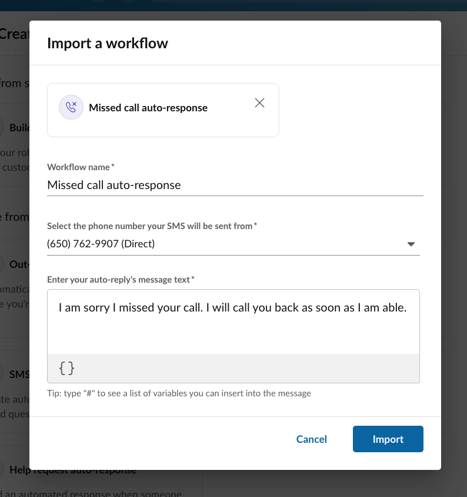

# Using RingCentral Automator

## Creating an automation

There are several ways to create an automation. The first and most common is by installing a pre-made automation using an [automation template](./workflow-templates/index.md). You can find and discover these pre-made solutions by clicking the "New automation" button found on the listing screen for your automations. 

The next way to create an automation is via Automator's workflow designer, a visual drag-and-drop tool that allows users to define [custom workflows](./custom-workflows/index.md) using their own [logical rules](./custom-workflows/conditionals.md) and [actions](./custom-workflows/actions/index.md) for responding to certain events that can [trigger](./custom-workflows/triggers/index.md) a workflow to be executed. 

!!! tip "You can also create an automation by importing them. See below."

## Limiting the frequency of automations

There are a number of scenarios in which one would like to limit how frequently an automation is run. Consider the circumstance where I am on vacatation and have set up an auto-response saying, "I am on PTO and will reply to your message on [insert date]." Let's then say a customer begins texting me multitple times. I only want to reply once per day to tell them I am on PTO. That will help me save money, as every SMS message I send may come with a small cost, and it keeps the conversation with the customer clean.

To limit automations in this way, to control how often they are run in response to a given event, look for following option found by editing an automation, or by editing the trigger associated with an advanced workflow. 

Any limit you set will apply within the context of a given individual you are communicating with. For example, you can limit an automation to run once per day per *phone number*. This means that if multiple people are texting you from multiple phone numbers, they will each receive your autoreply only once per day.  

## Exporting automations

Once an automation has been designed, built and tested, you may want to share the automations with others on your team, or with the larger RingCentral Automator community. One can do that by exporting the automation to a file, that can then be imported by users you send the file to. To export an automation:

1. Convert the automation to a custom or advanced automation
2. Edit the automation
3. From the more menu, select "Export automation"
      
      {style="max-width: 500px"}
	  
### Setting export parameters

Automations can be complex with a lot of elements that can be customized. In fact, every input associated with every [action](./custom-workflows/actions/index.md) that comprise a [custom workflow](./custom-workflows/index.md) is conceivably a way to customize the behavior of an automation. At times, it may be important to constrain what elements of an automation can be customized. Perhaps your company wants to standardize and control what a specific auto-reply message might be, while preserving the ability to customize what phone numbers an automation is active for. In this case, one can define an export parameter during the export process. 

Export parameters are associated with a specific action input, and then assigned a label. When the automation is later imported, the user importing the automation will be prompted to provide a value for each defined export parameter. 

## Importing automations

To import an automation you must first possess an export file (see "Exporting automations" above). Importing an automation will result in the creation of a custom automation within that user's list of automations. When the automation is imported, if the automation has any export parameters, the user will be prompted to provide a value for each of those export parameters. 

## Enabling and disabling automations

As soon as an automation is created you will be prompted to enable the automation. Once the automation is enabled, it will begin receiving and responding to events that trigger its execution. 

Being able to quickly toggle an automation on and off, allows you to preserve the automation without deleting it so that you can better manage it without necessarily deleting the underlying logic. 

Bear in mind, automations **must be disabled in order to be edited**. Therefore, while you are editing an automation, the automation will not be responding to events. 

!!! hint "If you find that you are unable to enable a custom automation using the drag-and-drop editor, make sure there are no blank/empty nodes within the automation. This can happen when you add a conditional node, but not all conditions result in an action being processed. To fix, it could be as simple as adding an "Exit" action to trigger the end of the automation. "

## Automation histories

Every execution of an automation is recorded for audit trail purposes. This allows you to see a history of when your automation was triggered and executed, with some limited insights into what happened when the automation was executed. 

For purposes related to data privacy and security, you will see limited data relating to data that triggered the automation. If you would like to see more data in your execution history, use the "Comment" action in your workflow to log more data to the execution history. 

!!! info "Histories are only maintained for seven days"
    Automation histories are only retained for seven days and exist primarily to help users troubleshoot and debug automations they have created. RingCentral may retain a history of the automation having run in different forms, e.g. the message store and a user's call log. 

#### Why is my automation history empty?

A history record is only created if the triggering event passes through all of the attached filters of that trigger. In other words, if you have an automation that is triggered by a missed call event, and a filter has been applied to that trigger that says, "only process this event if the caller's phone number does not start with '888'," then the automation will only run if the caller's phone number does not start with 888. So while there was an event that was received by Automator, the automation was never executed because the caller's phone number met the filter criteria of the trigger. 

## Testing automations

To assist users in producing automations that they are confident will address their needs and use cases in all their various forms, RingCentral Automator allows users to test the automation by simulating a triggering event. 

To test an automation, click the "Test" or "Save and test" buttons when editing the automation. You will then be prompted with a form that contains all the data associated with the automation's triggering event. Fill out this form, and click test to see a summary of the test's results, and to see what logical path the automation followed. 

## Embedding variables or performing text substitution in SMS messages

One can easily personalize or customize the contents of any text field in Automator using variables. Variables are tokens that will be replaced with an actual value at the time the automation is executed. For example, suppose you wanted an SMS out-of-office autoreply to be more personal, addressing the sender by name. You could do that using the following text:

> I am sorry {trigger.sender.name}, but I am OOO. 

Keeping track of all the variables might be tough. So, in any text box, type the hashtag/pound character, `#`, and a pull-down menu will appear allowing you to select the varibable to insert. 

The variables available to you depend upon the trigger your automation is using, as well as any actions that might have preceeded the one you are editing. For a complete list of all variables, and their meaning, consult the [actions](custom-workflows/actions/index.md) and [triggers](custom-workflows/triggers/index.md) in your specific workflow. 

