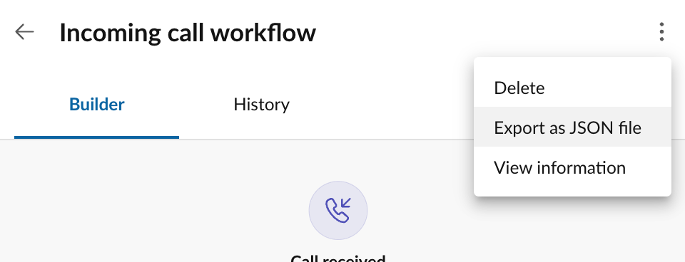
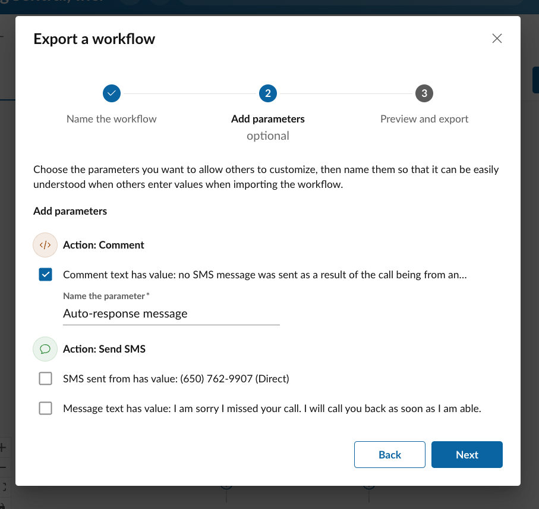

# Importing and exporting workflows

Importing and exporting workflows provides users with a convenient way to share workflows with others. This feature can be used within a company to help distribute workflows across a workforce, or it can be used to share helpful and useful workflows with the [Workflow Builder community](https://community.ringcentral.com/groups/workflow-builder-23) at large, which is actively encouraged.

## Exporting workflows

Once a custom workflow has been designed, built, and tested, you can share the workflow with others on your team, or with the larger RingCentral [Workflow Builder community](https://community.ringcentral.com/groups/workflow-builder-23). To share a workflow, export the workflow to a file, send the file to a coworker, and invite them to import the file. To export a workflow:

1. If you are starting from a template, [convert the workflow to a custom workflow](customization.md)
2. Edit and [customize the workflow](../workflows/custom/index.md)
3. From the "More" menu, select "Export as a JSON file"
      
      {style="max-width: 500px"}
	  
### Setting your export parameters

Workflows can be complex with many elements that can be customized. In fact, every input associated with every [action](../workflows/custom/actions/index.md) that comprise a [custom workflow](../workflows/custom/index.md) is conceivably a way to customize the behavior of a workflow. At times, it may be important to constrain what elements of a workflow can be customized. Perhaps your company wants to standardize and control what a specific auto-reply message might be, while preserving the ability to customize what phone numbers a workflow is active for. In this case, one can define an export parameter during the export process that allows users to customize only select elements of a workflow.

<figure markdown>
  
  <figcaption>Export parameters allow users to select what elements of a workflow can be customized by someone importing that workflow</figcaption>
</figure>

Export parameters are associated with a specific action input, and then assigned a label. When the workflow is later imported, the user importing the workflow will be prompted to provide a value for each defined export parameter. 

## Importing workflows

To import a workflow you must first possess an export file (see "Exporting workflows" above). Importing a workflow will result in the creation of a custom workflow within that user's Workflow Builder account. At the time the workflow is imported, if the workflow has any export parameters, the user will be prompted to provide a value for each of those export parameters. 

<figure markdown>
  
  <figcaption>This screenshot shows the import process for a workflow that has a number of export parameters.</figcaption>
</figure>

