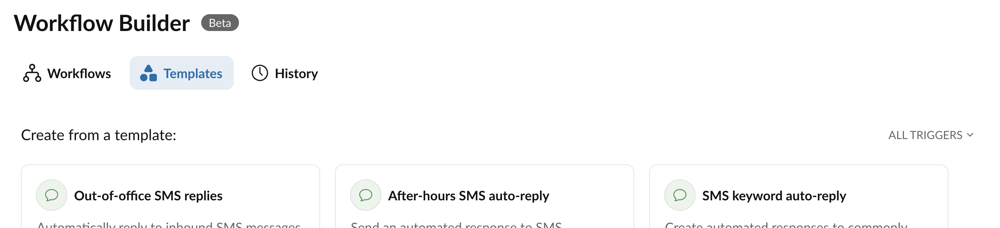
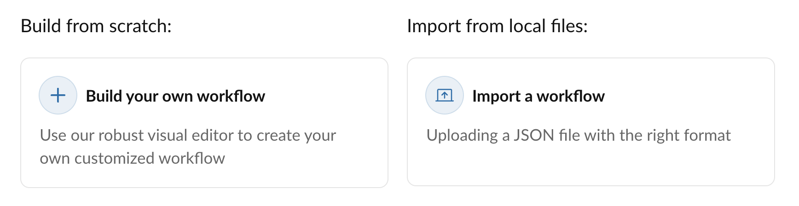

# Getting started with Workflow Builder

<iframe src="https://player.vimeo.com/video/1067058988?badge=0&amp;autopause=0&amp;player_id=0&amp;app_id=58479" frameborder="0" allow="autoplay; fullscreen; picture-in-picture; clipboard-write; encrypted-media" style="position:absolute;top:0;left:0;width:100%;height:100%;" title="Workflow Builder Intro"></iframe>

## Create a workflow from a template

There are several ways to create a workflow. The first and most common is by installing a pre-made workflow using a [workflow template](../workflows/index.md). You can find and discover these pre-made solutions by clicking the "New workflow" button found on the listing screen for your workflows, or by clicking the "Templates" tab from the Workflow Builder home screen. 

<figure markdown>
  
  <figcaption>The "Templates" tab lists all available templates in Workflow Builder, and is a great way to get started</figcaption>
</figure>

Workflow Builder provides two other ways to create a workflow, which is accessed by clicking the "New workflow" button from the home screen. 

<figure markdown>
  
  <figcaption>Create a custom workflow or import a workflow</figcaption>
</figure>

## Import a workflow or recipe

Discover a variety of popular workflows in our catalog of [workflow recipes](../workflows/index.md#recipes). Some recipes provide a complete solution to common use case, like our [missed call auto-reply](../workflows/recipes/missed-call.md). Other recipes are helpful learning tools that can help you jump start the workflow creation process, like our recipe on how [trigger workflows from IVR menus](../workflows/recipes/ivr-menus.md). 

## Create a custom workflow

The next way to create a workflow is via Workflow Builder's workflow designer, a visual drag-and-drop tool that allows users to define [custom workflows](../workflows/custom/index.md) using their own [logical rules](../workflows/custom/flow/index.md) and [actions](../workflows/custom/actions/index.md) for responding to certain events that can [trigger](../workflows/custom/triggers/index.md) a workflow to be executed. 

