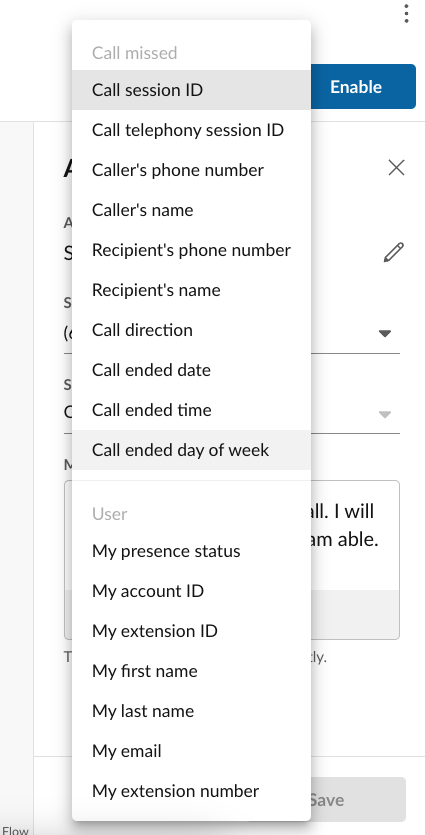

## Embedding variables or performing text substitution in SMS messages

One can easily personalize or customize the contents of any text field in Workflow Builder using variables. Variables are tokens that will be replaced with an actual value at the time the workflow is executed. For example, suppose you wanted an SMS out-of-office autoreply to be more personal, addressing the sender by name. You could do that using the following text:

> I am sorry {trigger.sender.name}, but I am OOO. 

Keeping track of all the variables might be tough. So, in any text box, type the hashtag/pound character, `#`, and a pull-down menu will appear allowing you to select the varibable to insert. 

The variables available to you depend upon the trigger your workflow is using, as well as any actions that might have preceeded the one you are editing. For a complete list of all variables, and their meaning, consult the [actions](../workflows/custom/actions/index.md) and [triggers](../workflows/custom/triggers/index.md) in your specific workflow. 

