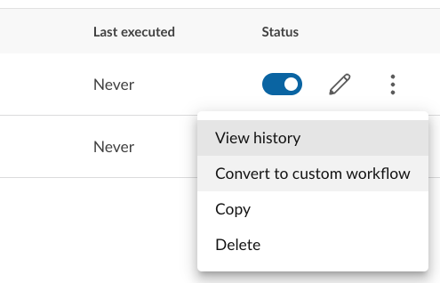
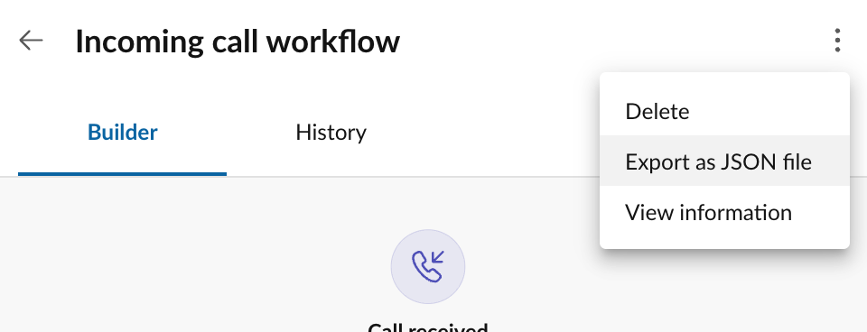

# Automation templates

Automation templates are pre-composed workflows designed around common use cases and situations. They provide users, especially less technical ones, with an intuitive and simple way to setup and configure common workflows. 

Automations created from a template only require users to fill out a simple form in order to create a new automation. The same form can be used to edit the workflow as well. 

To create an automation from a template, navigate to any automation listing screen, and click the "New automation" button. This will surface a dialog of automations to choose from. 

### Popular templates

{! docs/inc/templates.md !}

## Converting to "advanced workflows"

Any workflow created from a template can be converted to an "advanced workflow." Advanced workflows are edited using a visual drag-and-drop design tool. They give users complete control over the workflow, allowing them to modify the logic of a workflow at a more fundamental level.

To convert an automation to an advanced workflow, follow these steps:

1. Find the automation in your list of automations. 
2. Disable the automation. 
3. From the more menu associated with that automation, select "Convert to advanced."

<figure markdown>
  { style="max-width: 400px" }
  <figcaption>Start with a template, and then customize it to meet your specific needs</figcaption>
</figure>

Doing the above will take you to the workflow designer for that automation. If you make any changes to the automation and save them, you will be unable to revert the automation to a simple template.

While users do not need to know how to program in order to edit an advanced workflow, they do require users to be comfortable with simple concepts, such as:

* Controlling the flow of an automation using conditionals
* Specifying when automations should run by customizing the workflow's triggering event
* Chaining actions together to perform desired operations

## Creating and sharing your own templates

Any custom workflow you design can be exported to share with others. To export a custom automation you have built, navigate to the workflow editor for that automation, and from the more menu, select "Export automation." A dialog will appear prompting you setup workflow parameters. Setup your parameters (see below), and click "Export" to download the template. 

<figure markdown>
  
  <figcaption>Export an automation to share with others</figcaption>
</figure>

The file you download will be in JSON format. Send the file to another user as you see fit. An automation export file can be imported into Automator by navigating to any automation listing screen, and selecting "Import automation" from the more menu.

Upon importing an automation, users will be prompted to enter in configuration parameters for that automation. Click the "Import" button and the automation will be loaded into the current user or extension's account. 

### Setting up configuration parameters

When an automation is exported, you will given the option of allowing certain fields within the automation to be configurable by the user who imports the file later on. Users will be prompted to enter values for these parameters when the file is imported. 

To setup a configuration parameter, click the "Add parameter" button on the Export automation screen. Select the input field you wish to make customizable, and then select a name for that field. Repeat this process for your desired parameters and click the "Export" button when you are finished. 

<figure markdown>
  
  <figcaption>Define parameters that will be set with the automation is imported</figcaption>
</figure>

**Why use export configuration parameters?**

Setting a configuration parameter while exporting is useful when you need to account for some variability between one user and another, whhile also enforcing that aspects of the automation remain uncustomizable for the end user. This is helpful for example when you want create a standardized out-of-office auto-reply message for all employees in the company, while allowing users to easily customize from which number an SMS message may be sent, as that can vary from one user to another. 
