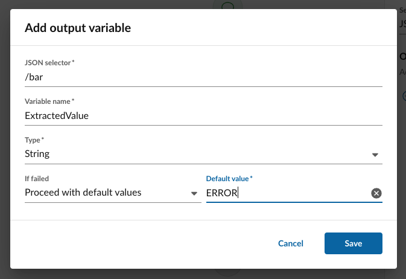

# Action: parse JSON

Extracts specific data points from a JSON data structure or from a variable of type "Object." This is useful for example when processing the response that is returned in an API call made through the "Send HTTP request" node. 

## Input

| Variable           | Type         | Description                                                                                                   |
|--------------------|--------------|---------------------------------------------------------------------------------------------------------------|
| **JSON variable** | Object/JSON  | The source variable or JSON structure to be parsed.                                                           |
| **Output variables**| List         | A series of defined extractions. Each requires a JSON selector, a name, a type, and an error handling rule.    |

<figure markdown>
  
  <figcaption>Defining variables to extract from a JSON payload</figcaption>
</figure>

### Configuration Details

For each output variable defined, the node requires:

* **JSON Selector:** The path used to identify the location in the document from which to extract the value.
* **Name:** The name of the variable to be created.
* **Type:** The data type of the extracted value.
* **Error Handling:** The logic to follow in the event the selector fails or the data is missing.

### Error handling

Each output variable can define what to do in the event of a failed extraction. Options include:

* **Fail workflow execution**. This terminates the workflow and marks it as an error. 
* **Proceed with default values**. This allows execution of the workflow to continue and populates the output variable with a default value the user provides. 
* **Log a warning and continue execution**. This allows execution of the workflow to continue, logs a warning visible in the execution history, and assigns a null value. 

<figure markdown>
  
  <figcaption>Defining what happens in the event of a parse error</figcaption>
</figure>

## Output

The node outputs individual variables as defined in the "Output variables" section.