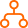

# Flow control

Conditional and switch nodes within a workflow provide users with a way of forking the flow of their workflow based upon a set of rules they define. For example, you may wish to send different SMS messages to someone contacting based upon their area code, or some other criteria. To create logic like this, one must first add a conditional node to their workflow, and then populate the different paths of that conditional node with the actions they want to execute within that logical pathway. 

There is no limit on the number of conditions a workflow can contain, and conditions can be nested as well, allowing for the formulation of more complex logical pathways. 

## Using variables to control the flow of a workflow

You may find when defining the conditions of a conditional node different types of varibales around which a rule can be built. These types are utilized to help users in finding the right variable to test. These variable types are:

* **Trigger variables**. These variables related to the event that caused the workflow to be executed. This may contain for example the phone number of the person who may have sent an SMS message that in turn triggered the workflow.

* **User variables**. These variables relate to the person who owns the workflow, or on whose behalf the workflow is being run. This can be useful if you want to build a rule based upon whether or not the current user's status is set to "do not disturb."

* **Action variables**. These variables relate to the variables added to the workflow in response to another action previously being executed. For example, you may wish to generate a transcription using an action, then respond different based upon the content's of that transcription. 

## List of available nodes

- { .icon-node } __[If](if.md)__
<!--- { .icon-node } __[Exit](exit.md)__-->
<!--- { .icon-node } __[Repeat for each](foreach.md)__-->
<!--- { .icon-node } __[Repeat while](while.md)__-->
- { .icon-node } __[Switch](switch.md)__

