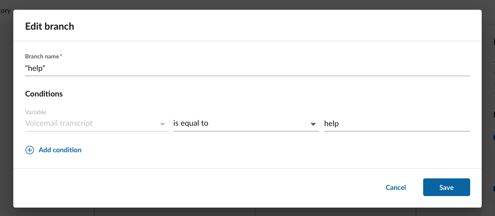

# Flow control: switch

Switch nodes provide users with the way of selecting a single variable, and to generate any number of paths to follow based upon the value of that variable. Switch nodes are very powerful because they can be much more flexible in dealing with more complex decision trees, as more traditional condition nodes are restricted to testing a single condition: if this, then that.

You can see what a switch node looks like in our visual workflow designer below. 

<figure markdown>
  
  <figcaption>More experienced users can build custom workflows from scratch</figcaption>
</figure>

### Selecting the switch variable

When creating a switch node, the first thing you must do is select the variable that will be used in evaluated which branch or path the workflow will follow. So step one, shown below, is about selecting this variable. 

<figure markdown>
  
  <figcaption>More experienced users can build custom workflows from scratch</figcaption>
</figure>

### Adding switch branches

Once you select the variable, you can click the "Add branch" button to add as many logical paths or branches that can stem from the value of this one variable. One really good use case for this is in writing different responses to incoming text messages. For example:

* If the incoming SMS message has "directions" in it, send a link to Google Maps. 
* If the incoming SMS message has "hours" in it, send our office hours.
* If the incoming SMS message has "sales" in it, alert our sales staff about a new lead. 
* If the incoming SMS message has "help" or "support" in it, send a link to our contact us page. 
* Otherwise, a.k.a. "else," do this other thing. 

The above scenario illustrates how a single switch statement can power a relatively complex SMS auto-reply system. 

<figure markdown>
  
  <figcaption>More experienced users can build custom workflows from scratch</figcaption>
</figure>