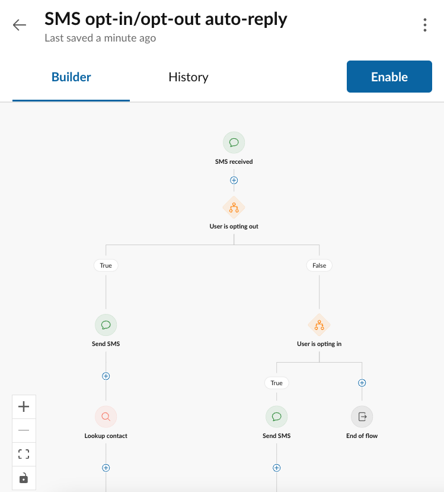
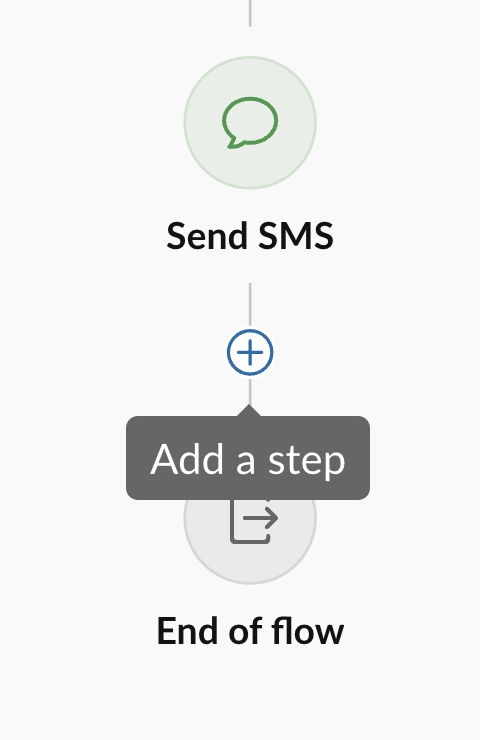
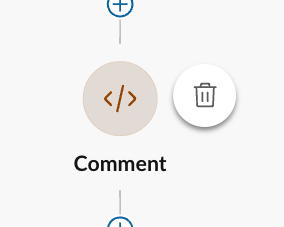
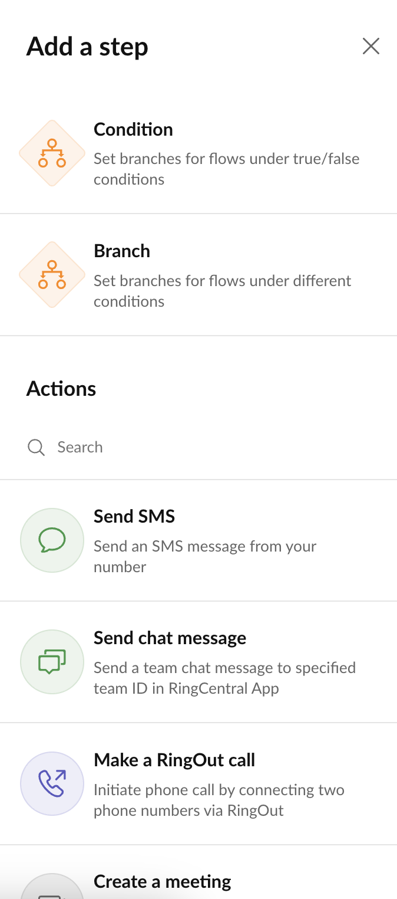
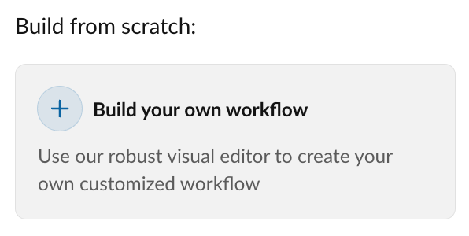

# Creating custom workflows using Workflow Builder

!!! tip "Share your workflow"
    Have a workflow you love? Export and share it with the community as a [recipe](../index.md#recipes).
	
	[Share your recipe via Github &raquo;](https://github.com/ringcentral/ringcentral-automator-docs/issues/new)

<iframe src="https://player.vimeo.com/video/1068338741?badge=0&amp;autopause=0&amp;player_id=0&amp;app_id=58479" frameborder="0" allow="autoplay; fullscreen; picture-in-picture; clipboard-write; encrypted-media" style="position:absolute;top:0;left:0;width:100%;height:100%;" title="Unleash the Automation Power of RingCentral Workflow Builder by Creating Custom Workflows from Scratch"></iframe>

Custom workflows and workflows are intended for power-users who wish to define more complex logic, rules and conditions than Workflow Builder's ready-made templates may provide out of the box. While it is the goal of Workflow Builder to enable any user to create a custom workflow, some may wish to enlist the help of someone more technical to consult on the creation of a custom workflow, especially if the creation of rules and specification of actions is something they are not comfortable with. 

<figure markdown>
  
  <figcaption>Workflow Builder's workflow designer is a visual way to create simple apps with NO CODE</figcaption>
</figure>

## Editing workflows

### Adding and removing a node in a workflow

Nodes are added to a workflow by clicking the "+" icon located between nodes. At any of these locations, conditionals and action nodes can be inserted. 

<figure markdown>
  { style="max-width: 400px" }
  <figcaption>Click the "+" icon to add a node</figcaption>
</figure>

<figure markdown>
  { style="max-width: 400px" }
  <figcaption>Delete the node from the node's more menu</figcaption>
</figure>

### Selecting an action to add to a workflow

When adding an action, you will be given a chance to select from a list of available actions. Select the action you want to add and click "Add." 

<figure markdown>
  { style="max-width: 400px" }
  <figcaption></figcaption>
</figure>

!!! hint "Why are some action's disabled, or greyed-out?"
    From time to time you may find an action listed that is disabled and cannot be added to a workflow. This is due to the feature associated with that action not being abled for your account. The most common scenario for this are actions related to sending SMS because in order to send SMS messages, users must go through what is often a multi-step approval and setup process with RingCentral and carriers to fully enable SMS for an account. 

## Customizing a workflow template

One of the most common ways used to create a workflow is to create a workflow from a template, and then customize it by converting it to a "custom workflow." This has the advantage of starting from a place known to be fully tested and functional, and then customizing it sometimes in small, but impactful ways. It can save a lot of time from building a workflow from zero.

<figure markdown>
  { style="max-width: 400px" }
  <figcaption>Start with a template, and then customize it to meet your specific needs</figcaption>
</figure>

## Building a custom workflow from scratch

Sometimes there is no template that serves as a good starting point. When this happen, you can start with a blank canvas by clicking "New workflow" and selecting the "Build your own workflow" option. You will then be prompted to select the triggering event, and then you will be taken a blank workflow into which you can begin adding [actions](./actions/index.md) and [conditionals](./conditionals.md).

<figure markdown>
  { style="max-width: 300px" }
  <figcaption>More experienced users can build custom workflows from scratch</figcaption>
</figure>

