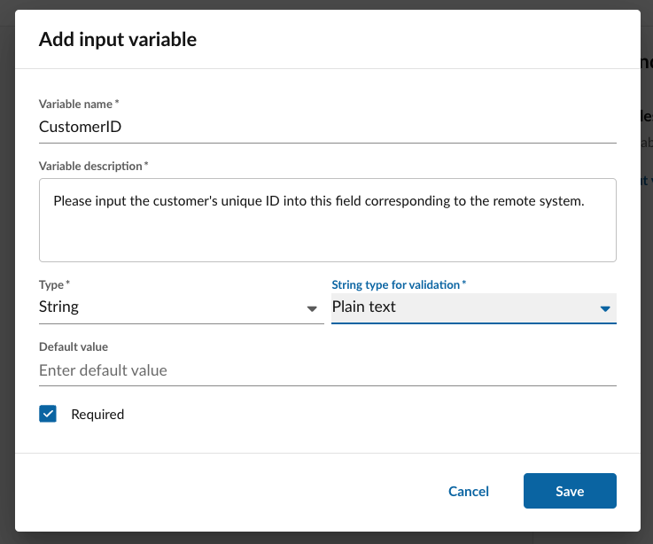
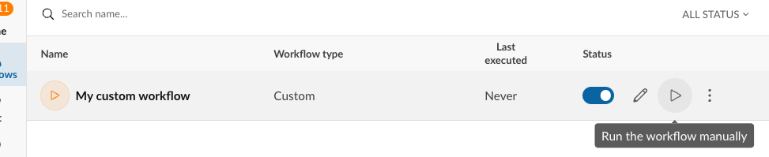
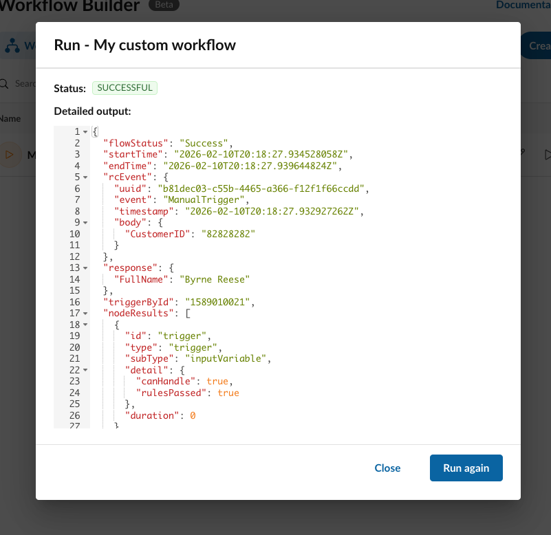

# Trigger: On-demand

The **On-Demand trigger** is designed for workflows that require manual initiation by a user within Workflow Builder (WFB). Unlike automated triggers that rely on system events or fixed schedules, On-Demand workflows are ideal for **ad-hoc business processes**.

**When to use On-Demand workflows:**

* **Non-predictable schedules:** Processes that occur as part of a manual program rather than at set intervals.
* **Human-initiated automation:** Tasks that require a human to decide exactly when the logic should execute.
* **Ad-hoc maintenance:** One-off data updates, specialized reporting, or system syncs that aren't tied to a specific external event.

!!! tip "The future of on-demand variables"
    Currently, on-demand workflows can only be executed manually from within Workflow Builder. In the future however, these workflows will be exposed through a REST API, invocable over MCP, and will be embeddable within other workflows. 
    
    In addition, today inputs and outputs are provided as raw JSON. In the future inputs and outputs will be collected and displayed in a more human-friendly and structured manner. 

## Inputs

When a user executes an On-Demand workflow, WFB prompts them to provide data based on the inputs defined by the workflow creator. This data is provided via a **JSON data structure**.


### Supported Data Types

WFB validates inputs based on the following types:

| Data type | Description | 
|-|-|
| `String` | Textual data. To ensure higher data quality, Strings support several sub-types for added validation: Plain Text, Email, URL, Phone Number, Selection (Drop-down choices), Date, Time, Timestamp |
| `Number` | Integer or decimal values. |
| `Boolean` | True/False values. |
| `Object` | Non-scalar values, typically presented as an associative array (key-value pairs) in JSON. |
| `Array` | A list of values or objects. |



## Outputs

Outputs can be defined similarly to inputs by clicking on the **End** node. The defined outputs will then be included in the workflows structured output layer allowing you to easily extract the data you require. 


## Execution

Executing an on-demand workflow is done from the workflow listing screen. One can click the "Run" button when hovering over an on-demand workflow. 



1. **Trigger:** A user manually selects the workflow from the WFB interface.
2. **Data Entry:** WFB prompts the user for the required inputs. The user provides these via the UI, which compiles them into the necessary JSON format.
3. **Processing:** The workflow runs the defined logic using the provided inputs.
4. **Review:** Upon completion, the user can view the JSON output and metadata directly in the WFB execution history to verify the results.



**Sample execution output**

```js hl_lines="6-8"
{
    "flowStatus": "Success",
    "startTime": "2026-02-10T20:18:27.934528058Z",
    "endTime": "2026-02-10T20:18:27.939644824Z",
    "response":
    {
        "FullName": "Byrne Reese"
    },
    "rcEvent":
    {
        "uuid": "b81dec03-c55b-4465-a366-f12f1f66ccdd",
        "event": "ManualTrigger",
        "timestamp": "2026-02-10T20:18:27.932927262Z",
        "body":
        {
            "CustomerID": "82828282"
        }
    },
    "triggerById": "1589010021",
    "nodeResults": [
    {
        "id": "trigger",
        "type": "trigger",
        "subType": "inputVariable",
        "detail":
        {
            "canHandle": true,
            "rulesPassed": true
        },
        "duration": 0
    },
    {
        "id": "action-1770751293728",
        "type": "action",
        "subType": "setVariable",
        "detail":
        {
            "success": true,
            "parameter":
            {
                "variables":
                {
                    "custom.variable1770751285304": "Byrne Reese"
                }
            }
        },
        "duration": 4
    },
    {
        "id": "action-exit-1770751124589",
        "type": "action",
        "subType": "exit",
        "detail":
        {
            "success": true
        },
        "duration": 0
    }]
}
```


## Executing on-demand workflows

## Trigger variables

| Trigger variable | Type | Description |
|-|-|-|
| **Sender's phone number** | Phone number | The phone number that sent the SMS message that was received. |
| **Sender's name** | String | If the sender exists in your address book, this variable will contain the name stored in your address book. |
| **Recipient's phone number** | Phone number | The phone number that received the SMS. |
| **Message text** | String | The exact text of the received message. |
| **Is image attached** | boolean | True if the received SMS contained an image. |
| **Message received date** | date | The date the message was received, in the format of YYYY-MM-DD. |
| **Message received time** | time | The time the message was received, in the format of HH:MM:SS (AM|PM) | 
| **Message received day of week** | day of the week | |

